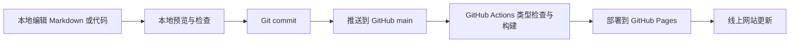
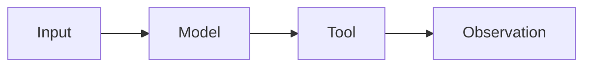

# 网站使用与维护指南

这份指南是本站的长期操作手册。它覆盖两类工作：一类是高频的笔记新增、修改和发布；另一类是低频但更需要谨慎的网站代码、依赖版本、视觉设计、故障和部署维护。

网站的基本原则是：**Markdown 是内容源，Git 是版本历史，`main` 是线上状态，GitHub Actions 负责构建和发布。** 只要仓库仍然完整，网站就可以重新构建和恢复。

## 1. 先理解网站的工作方式

本站由 Docusaurus 生成静态文件，并由 GitHub Pages 托管。一次正常更新会经过下面的流程：



线上网站地址是 `https://woxiangjinbu-ymt.github.io/`，源码仓库是 `Woxiangjinbu-ymt/Woxiangjinbu-ymt.github.io`。网站没有在线数据库；笔记正文、标签、首页状态和设计代码都保存在仓库中。

## 2. 本地环境与首次准备

### 2.1 环境要求

- Git
- Node.js 24，版本记录在 `.nvmrc`
- npm 11，版本记录在 `package.json` 的 `packageManager`
- 能够访问 GitHub 的 SSH 身份

进入项目目录后执行：

```bash
cd /Users/tianmu/Desktop/Develop/personal-site
nvm use
npm ci
npm start
```

浏览器访问 `http://localhost:3000/`。开发服务器会监听文件变化，保存 Markdown、TypeScript 或 CSS 后通常会自动刷新。

`npm ci` 严格按照 `package-lock.json` 安装依赖，适合日常恢复环境和验证。只有在明确升级依赖时才使用 `npm install`。

### 2.2 每次开始工作前

先确认自己位于正确仓库，并同步远程更新：

```bash
git status
git switch main
git pull --ff-only
```

如果 `git status` 显示尚未提交的修改，先判断它们是否属于当前工作。不要为了同步代码而丢弃未提交内容。

## 3. 目录地图：应该修改哪里

| 目标 | 主要位置 | 说明 |
| --- | --- | --- |
| 长期知识笔记 | `docs/` | 按知识领域组织，会进入文档侧边栏 |
| 学习日志与复盘 | `blog/` | 按日期组织，会进入学习时间线和 RSS |
| 新文章模板 | `templates/` | 基础笔记、论文精读、研究日志模板 |
| 首页文字与结构 | `src/pages/index.tsx` | 首页各区块和链接 |
| 首页数据 | `src/data/status.ts` | 当前学习状态、领域卡片、最近更新 |
| 首页局部样式 | `src/pages/index.module.css` | 首页布局、字号、卡片和响应式规则 |
| 全站样式 | `src/css/custom.css` | 颜色变量、正文、导航、暗色模式 |
| 站点配置 | `docusaurus.config.ts` | 标题、网址、导航、页脚、插件和构建规则 |
| 文档侧边栏 | `sidebars.ts` 与 `_category_.json` | 当前以自动生成目录为主 |
| 文档标签 | `docs/tags.yml` | 文档允许使用的标签 |
| 博客标签与作者 | `blog/tags.yml`、`blog/authors.yml` | 博客允许使用的标签和作者信息 |
| 静态资源 | `static/` | 图片、分享卡片和无需编译的文件 |
| 自动化 | `.github/workflows/` | 检查、部署与链接检查 |
| 依赖版本 | `package.json`、`package-lock.json` | 前者声明版本，后者锁定完整依赖树 |

## 4. 判断内容应该放在 Docs 还是 Blog

使用下面的判断规则：

- 内容半年后仍需要不断修订，放入 `docs/`。
- 内容重点是“当时做了什么、如何理解、阶段结果是什么”，放入 `blog/`。
- 一次研究进展可以先写成 Blog；稳定结论形成后，再整理进 Docs。
- 不要把同一篇正文复制两份。Blog 应链接到稳定笔记，Docs 可以在修订记录中链接回阶段日志。

典型例子：

| 内容 | 推荐位置 |
| --- | --- |
| 动态规划的通用状态设计方法 | Docs / 算法专题 |
| 本周完成 20 道动态规划题后的复盘 | Blog |
| ReAct 的机制、公式和适用边界 | Docs / Agent 基础 |
| 一篇新论文的首次阅读记录 | Blog 或论文笔记草稿 |
| 多篇论文比较后的稳定研究地图 | Docs / 论文精读 |

## 5. 日常新增一篇知识笔记

### 5.1 从模板开始

根据内容选择模板：

- `templates/fundamentals-note.md`：概念、原理与方法笔记
- `templates/paper-note.md`：论文精读与复现记录
- `templates/research-blog.md`：研究进展、学习日志和阶段复盘

例如创建一篇 Agent 基础笔记：

```bash
cp templates/fundamentals-note.md docs/02-llm-agents/fundamentals/example-topic.md
```

文件名使用小写英文和连字符，例如 `tool-selection.md`。URL 中不要使用空格、临时编号或难以长期保持的日期。

### 5.2 填写 front matter

文档顶部的 YAML 区域决定页面元数据：

```yaml
---
title: Tool Selection
description: Agent 如何根据任务状态选择和调用合适的工具。
slug: /llm-agents/fundamentals/tool-selection
sidebar_position: 8
tags: [agent-fundamentals]
draft: true
---
```

字段约定：

- `title`：清晰说明主题，不使用“学习笔记 1”一类临时名称。
- `description`：一到两句话，能够独立说明页面内容，也用于搜索摘要。
- `slug`：发布后的稳定网址；页面发布后尽量不要修改。
- `sidebar_position`：同一目录内的阅读顺序。
- `tags`：只能使用 `docs/tags.yml` 中已登记的标签。
- `draft`：写作阶段保持 `true`；准备公开时删除该行或改为 `false`。

草稿不会出现在生产网站中，但本地开发环境可以预览。不要用“先发布空页面，以后再补”的方式代替草稿。

### 5.3 推荐正文结构

一篇可长期维护的知识笔记通常包含：

1. 问题是什么，以及为什么值得记录。
2. 核心思想和术语定义。
3. 机制、算法或推导过程。
4. 最小示例或可复现代码。
5. 适用场景、失败情况和边界。
6. 与相关方法的比较。
7. 参考资料和修订记录。

不要追求一次写完。先写出能够被未来的自己理解和验证的最小版本，再逐步增加证据、例子和边界条件。

## 6. 新增一篇 Blog 日志

博客文件名使用 `YYYY-MM-DD-slug.md`：

```text
blog/2026-08-04-example-research-log.md
```

front matter 示例：

```yaml
---
title: 一周研究复盘：Agent 技能评估
description: 本周阅读、实验结果、失败原因和下一步计划。
slug: /2026/08/04/agent-skill-evaluation
date: 2026-08-04
authors: [ymt]
tags: [research-log, retrospective]
draft: true
---
```

开头先写一段可以在列表页独立阅读的摘要，然后加入：

```md
<!-- truncate -->
```

标记后的内容只在文章详情页显示。构建规则会拒绝缺少截断标记的公开博客，避免整篇文章挤满列表页。

Blog 应保留当时的判断。后续事实发生变化时，在文末添加更新说明，而不是静默改写历史观点；普通错别字、错误链接和明确事实错误可以直接修正。

## 7. 修改已有笔记

### 7.1 普通修订

1. 打开原文件修改正文。
2. 检查标题层级和站内链接。
3. 在“修订记录”中补充日期和变化摘要。
4. 本地预览受影响页面。
5. 运行提交前检查并提交。

不要因为内容发生较大变化就轻易新建重复页面。只要研究对象和页面承诺没有改变，应继续修订原文。

### 7.2 修改 URL 或移动文件

移动文件前先全仓库查找引用：

```bash
rg "/docs/旧路径|旧文件名" docs blog src README.md
```

优先保留原来的 `slug`，这样即使源文件移动，公开 URL 也不变。如果必须更换 URL，需要同步更新所有站内链接，并考虑为旧地址增加重定向；完成后务必运行生产构建。

### 7.3 删除页面

删除前确认：

- 内容是否应该合并到另一篇笔记。
- 是否被首页、导航、其他文章或外部资料引用。
- 是否应该先保留一条迁移说明。

删除后的恢复依赖 Git 历史，因此不要使用强制推送抹掉历史。

## 8. 标签、链接、图片、公式与图表

### 8.1 标签

文档标签必须先登记在 `docs/tags.yml`，博客标签必须先登记在 `blog/tags.yml`。标签表示跨目录主题，不要把目录名称、文章名称和临时项目名全部变成标签。

新增标签时同时填写：

- 稳定的英文键
- 中文或英文展示名称
- 唯一 permalink
- 能说明收录范围的 description

### 8.2 站内和站外链接

- 站内链接优先使用公开路径，例如 `/docs/llm-agents/fundamentals/react`。
- 论文优先链接 DOI、arXiv 或会议官方页面。
- 事实性结论尽量链接第一方来源。
- 不要链接本地绝对路径或登录后才能访问的私人页面。
- 每周自动链接检查发现问题后，应判断是更新链接、替换来源还是删除失效引用。

### 8.3 图片

笔记图片建议放在：

```text
static/img/notes/<领域>/<文章-slug>/
```

Markdown 中使用：

```md

```

上传前压缩图片，删除位置、设备和隐私相关元数据。文件名应说明内容，不使用 `截屏1.png`。装饰性图片要克制，研究图表应说明数据来源和含义。

### 8.4 数学公式与 Mermaid

行内公式使用 `$...$`，块级公式使用 `$$...$$`。流程和结构关系可以使用 Mermaid：

````md

````

复杂图表提交前必须在本地确认浅色和暗色模式都可读。

## 9. 连接 GitHub 代码仓库

独立代码仓库建立后，每篇涉及复现的笔记同时提供两类链接：

- **最新实现**：指向默认分支，方便查看持续维护的版本。
- **固定版本**：指向 commit SHA 或 release tag，保证文章结论可以复现。

推荐格式：

```md
- [最新实现](https://github.com/Woxiangjinbu-ymt/<code-repo>)
- [本文对应版本](https://github.com/Woxiangjinbu-ymt/<code-repo>/tree/<commit-sha>/path)
- 最后验证日期：YYYY-MM-DD
```

不要只链接默认分支后就声称结果可复现，因为默认分支会继续变化。代码、环境、数据和文章结论应能够对应到同一个固定版本。

## 10. 提交、推送与分支策略

### 10.1 小型内容更新

只修改一两篇笔记且风险很低时，可以在同步后的 `main` 上完成：

```bash
git status
git add docs/具体文件.md
git commit -m "docs: update note about tool selection"
git push origin main
```

`git add` 尽量写具体路径，避免把临时截图、密钥或不相关修改一起提交。

### 10.2 网站代码、依赖或大规模内容更新

涉及设计、配置、依赖、目录重构或多篇文章时，使用独立分支：

```bash
git switch main
git pull --ff-only
git switch -c fix/homepage-heading-wrap
```

完成修改并检查后：

```bash
git add src/pages/index.tsx src/pages/index.module.css
git commit -m "fix: prevent orphaned homepage headings"
git push -u origin fix/homepage-heading-wrap
```

然后在 GitHub 创建 Pull Request。等待 `Check` 工作流通过后再合并。这样能够在上线前看到完整差异，并保留清晰的讨论和回退点。

### 10.3 提交信息约定

- `docs:` 新增或修改笔记
- `fix:` 修复网站问题、错误链接或错误内容
- `feat:` 新增网站能力或明显功能
- `style:` 只调整视觉样式
- `chore:` 依赖、工作流和常规维护
- `refactor:` 不改变功能的代码重构

一次提交只表达一个目的。不要把“新增论文笔记、升级依赖、重做首页”放在同一个提交中。

## 11. 提交前检查

任何公开更新至少执行：

```bash
npm run typecheck
npm run build
```

检查结果的含义：

- `typecheck` 验证 TypeScript 配置和页面代码。
- `build` 生成生产网站，并严格检查失效链接、锚点、重复路由、未知标签、博客摘要、Markdown 图片和 Mermaid。

涉及视觉或交互时，再运行：

```bash
npm start
```

人工查看：

- 桌面和窄屏下是否溢出或出现孤字换行。
- 浅色与暗色模式是否都有足够对比度。
- 导航、搜索、站内链接和返回路径是否工作。
- 图片是否加载，公式和 Mermaid 是否渲染。
- 键盘焦点、按钮文字和图片替代文字是否清楚。

## 12. 发布与线上确认

推送到 `main` 后，`.github/workflows/deploy.yml` 会自动：

1. 安装锁定依赖。
2. 运行 TypeScript 检查。
3. 生成生产静态网站。
4. 上传构建产物。
5. 部署到 GitHub Pages。

在仓库的 **Actions → Deploy to GitHub Pages** 查看状态。工作流成功后检查：

- 首页：`https://woxiangjinbu-ymt.github.io/`
- 本次修改的具体页面
- 搜索是否能找到新发布内容
- RSS：`https://woxiangjinbu-ymt.github.io/blog/rss.xml`

GitHub Pages 可能需要几十秒传播。不要在工作流仍运行时反复提交相同修改。

## 13. 网站代码与设计维护

### 13.1 修改首页内容

- 修改区块结构和固定文案：`src/pages/index.tsx`
- 修改当前状态、领域卡片和最近更新：`src/data/status.ts`
- 修改首页排版：`src/pages/index.module.css`

最近更新目前由 `src/data/status.ts` 手工选择，不会自动读取全部文章。发布重要笔记后，若希望它出现在首页，需要同步更新这里的条目和日期。

### 13.2 修改全站视觉

颜色、字体、正文宽度、导航和暗色模式主要在 `src/css/custom.css`。修改前先寻找已有 CSS 变量，避免在多个组件中重复硬编码颜色。

设计修改的安全顺序：

1. 明确只改变哪一层：内容、局部组件还是全站视觉系统。
2. 建立独立分支。
3. 优先调整现有变量和局部样式。
4. 检查常见桌面宽度、窄屏、浅色和暗色模式。
5. 运行类型检查和生产构建。
6. 通过 Pull Request 合并。

社交分享图位于 `static/img/social-card.png`。如果网站标题、配色或视觉语言发生明显变化，应同时更新分享图，并确认 `docusaurus.config.ts` 中的 `themeConfig.image` 仍指向正确文件。

### 13.3 修改导航和分类

顶部导航和页脚在 `docusaurus.config.ts`。文档目录由 `sidebars.ts` 自动扫描，文件夹的 `_category_.json` 决定分类名称、顺序和入口文档。

分类调整最容易造成路由或文档 ID 错误。修改后以 `npm run build` 为最终判断，不要通过关闭严格链接检查来掩盖问题。

## 14. 版本与依赖维护

### 14.1 三层版本记录

本站使用三层版本记录：

1. **Git commit**：每一次内容和代码变化的精确版本。
2. **Git tag**：重要网站阶段，例如 `site-v1.0.0`。
3. **依赖锁文件**：`package-lock.json` 固定可重复构建的依赖树。

一般笔记更新不需要创建 tag。首页重构、技术栈升级、目录体系变化或正式阶段发布时，可以创建站点版本：

```bash
git tag -a site-v1.1.0 -m "site v1.1.0"
git push origin site-v1.1.0
```

版本含义建议：

- PATCH：修复样式、错误链接和小问题。
- MINOR：新增功能、栏目或明显设计能力。
- MAJOR：不兼容的目录、URL 或技术架构变化。

### 14.2 处理 Dependabot

Dependabot 每月检查 npm 和 GitHub Actions。收到更新 Pull Request 后：

1. 阅读版本说明和 breaking changes。
2. 确认所有 `@docusaurus/*` 包保持同一版本。
3. 检查 `package.json` 和 `package-lock.json` 的差异。
4. 等待自动检查通过。
5. 对主要版本升级进行本地预览。
6. 一次合并一组相关更新，出现问题时容易定位。

不要直接执行 `npm audit fix --force`。它可能降级或跨主要版本替换核心包。先理解依赖链，再做可验证的定向升级或 `overrides`。

### 14.3 升级 Node.js

升级 Node.js 时需要同步修改：

- `.nvmrc`
- `package.json` 的 `engines.node`
- `package.json` 的 `packageManager`（如果 npm 一起变化）
- `.github/workflows/check.yml`
- `.github/workflows/deploy.yml`
- README 与本指南中的环境说明

完成后删除并重新安装依赖不是第一选择；先运行 `npm ci` 验证锁文件能否在新版本环境中正常工作。

## 15. Bug 处理流程

### 15.1 先复现再修改

记录四件事：

- 出问题的 URL 或文件。
- 预期行为。
- 实际行为。
- 浏览器、屏幕宽度或触发步骤。

然后建立 `fix/...` 分支，用最小改动修复。不要在没有复现的情况下顺便重构相关代码。

### 15.2 常见问题速查

| 现象 | 优先检查 |
| --- | --- |
| 标题出现孤字换行 | 容器宽度、`font-size`、`white-space`、响应式断点 |
| 文档不在侧边栏 | `draft`、目录位置、`_category_.json`、front matter |
| 构建提示 unknown tag | 标签是否登记在对应 `tags.yml` |
| 构建提示 broken link | 链接目标、slug、文档 ID 和文件移动记录 |
| 博客构建失败 | 是否缺少 `<!-- truncate -->`、作者或标签是否合法 |
| 页面显示 404 | Pages 工作流、`baseUrl`、路由是否发布、部署是否完成 |
| 搜索找不到文章 | 页面是否仍为草稿、生产构建是否完成、关键词是否存在 |
| 样式只在暗色模式异常 | `custom.css` 中暗色变量和硬编码颜色 |
| 页脚下方出现白色横条 | 页面级横向溢出、浏览器扩展注入元素，以及根节点的 `overflow-x` |
| `npm ci` 失败 | Node/npm 版本、锁文件是否与 `package.json` 一致 |

### 15.3 不要用“放宽检查”修复问题

`onBrokenLinks`、`onBrokenAnchors`、未知标签和重复路由都被设置为严格失败。这些规则是长期维护的保护网。出现错误时修复源内容，不要把配置从 `throw` 改成忽略。

## 16. 回退与恢复

如果已经上线的最新提交有问题，优先创建一个反向提交：

```bash
git log --oneline -10
git revert <有问题的-commit-sha>
git push origin main
```

`git revert` 会保留完整历史，并触发一次新的安全部署。不要使用 `git reset --hard` 配合强制推送来回退公开主分支。

恢复被删除的单个文件时，可以从旧提交取回：

```bash
git restore --source=<正常版本的-commit-sha> -- docs/具体文件.md
```

恢复后仍需检查、提交和推送。

## 17. 隐私、安全与版权

这个仓库和网站都是公开的。提交前确认不包含：

- API key、访问令牌、密码、Cookie 或 `.env` 内容。
- 未公开研究数据、内部系统截图或受保密约束的信息。
- 电话、住址、证件、私人邮箱等不必要的个人信息。
- 未经授权的大段转载、整篇论文或受版权保护的图片。
- 求职过程中的公司内部信息、面试题原文和他人身份信息。

若密钥曾经提交到 Git，即使之后删除文件，也应立即到对应服务撤销并重新生成密钥；普通删除不能消除历史泄露。

## 18. 建议维护节奏

### 每次写作后

- 检查 front matter、链接、图片替代文字和草稿状态。
- 运行 `typecheck` 与 `build`。
- 提交信息准确描述变化。
- 发布后查看受影响页面。

### 每周

- 整理仍有价值的草稿。
- 处理自动链接检查结果。
- 把重要 Blog 结论沉淀到 Docs。
- 更新首页“最近更新”和当前学习状态。

### 每月

- 处理 Dependabot Pull Request。
- 检查首页、搜索、RSS 和移动端显示。
- 清理无引用图片和失效外部资料。
- 检查研究与求职内容是否需要进一步脱敏。

### 每季度或重要阶段

- 回顾分类树是否仍符合长期知识结构。
- 合并重复笔记，补充跨领域链接。
- 检查 Node.js、Docusaurus 和关键插件的支持状态。
- 对明显的网站阶段创建 Git tag。
- 确认 GitHub 仓库仍是完整、可恢复的远程备份。

## 19. 最短日常流程

如果只记住一套流程，使用下面这套：

```bash
git switch main
git pull --ff-only
nvm use
npm ci
npm start
```

完成笔记后：

```bash
npm run typecheck
npm run build
git status
git add docs/具体文件.md
git commit -m "docs: add or update topic note"
git push origin main
```

最后查看 GitHub Actions 和线上页面。对于网站代码、依赖、目录重构或不确定的修改，改用独立分支和 Pull Request。

这套流程的目标不是增加仪式，而是让每一次学习记录都有来源、每一次网站变化都可验证、每一次上线都能恢复。
