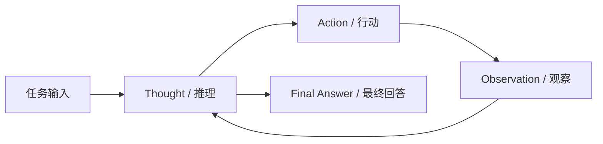

# ReAct: Reasoning and Acting

## 核心思想

ReAct 将语言模型产生的**推理轨迹**与面向外部环境的**行动**交错组织。推理用于维护任务状态、分解问题和决定下一步；行动用于调用搜索、计算器、代码执行器等外部工具，并把新的观察带回上下文。

与“一次性生成完整答案”相比，这种循环把信息获取和决策放进同一条轨迹中，使模型能够根据真实观察修正后续步骤。

## 关键机制



一个 ReAct 轨迹通常包含：

1. **Thought**：解释当前已知信息并选择下一步。
2. **Action**：按照工具协议发出调用。
3. **Observation**：接收工具或环境返回的结果。
4. **Stop condition**：信息足够时生成最终答案，否则继续循环。

如果将第 $t$ 步的上下文写作 $c_t$，工具观察写作 $o_t$，可以把循环抽象为：

$$
a_t \sim \pi_\theta(\cdot \mid c_t), \qquad c_{t+1} = c_t \oplus a_t \oplus o_t
$$

这里的关键不只是“模型会调用工具”，而是工具观察会进入下一步决策条件。

## 最小示例

```text
Question: 某篇论文的正式发表年份是什么？
Thought: 我需要先确认论文身份，再查找可信来源。
Action: search("paper title official publication")
Observation: 官方会议页面显示发表于 2023 年。
Thought: 已获得能够支持回答的来源。
Final Answer: 该论文正式发表于 2023 年。
```

## 代码复现

代码仓库尚未建立。创建独立实验仓库后，这里将同时提供：

- 指向默认分支的最新实现。
- 指向 commit SHA 或 release tag 的本文固定版本。
- 最后验证日期和运行环境。

## 相关工作对比

- **Chain-of-Thought** 主要在语言空间中展开推理，通常不要求和外部环境形成闭环。
- **Tool Use / Function Calling** 提供结构化行动接口，但不天然规定如何组织多步推理。
- **Reflection 类方法** 更强调根据失败经验生成反馈，并在后续尝试中使用这些反馈。

## 局限与适用场景

ReAct 适合需要外部信息、工具操作或多步验证的任务。它的主要风险包括轨迹冗长、错误观察累积、工具选择不稳定，以及缺乏可靠的停止判断。

## 修订记录

- 2026-08-04：建立笔记骨架，补充核心循环、公式和适用边界。
